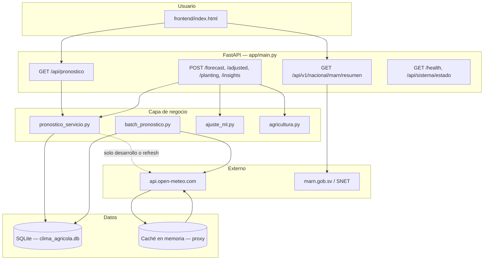
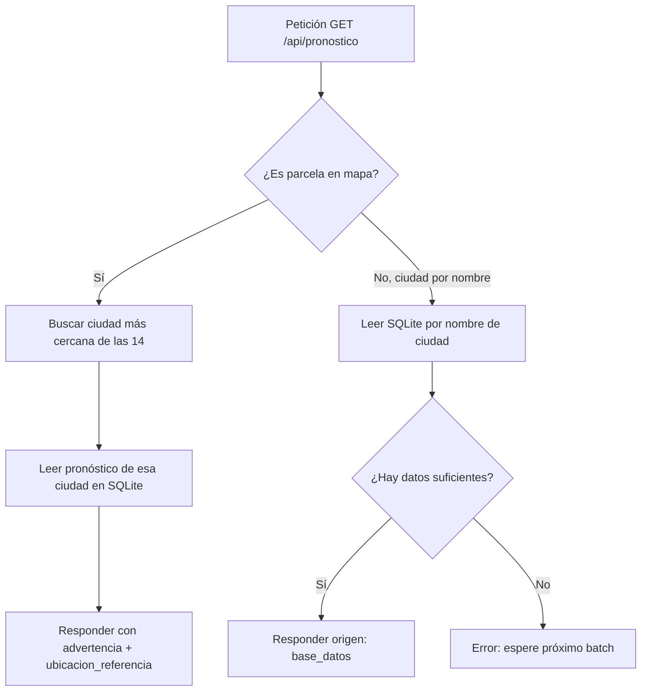

# Documentación técnica — Sistema Clima Agrícola El Salvador

**Versión:** post-optimización batch + proxy anti-429  
**Ruta del proyecto:** `C:\Users\clase\Desktop\clima`  
**Producción:** https://clima-glw1.onrender.com/

---

## 1. Propósito del sistema

La aplicación apoya decisiones de **siembra agrícola** en El Salvador. Combina:

| Fuente | Uso |
|--------|-----|
| **Open-Meteo** | Pronóstico diario real (temperatura, lluvia, humedad, viento) |
| **MARN / SNET** | Información complementaria oficial (estaciones SRT, enlaces) |
| **Machine Learning** | Ajuste opcional de temperatura y probabilidad de lluvia |
| **Reglas agronómicas** | Semáforo verde / amarillo / rojo para siembra |

El usuario interactúa con una **página web** (mapa Leaflet) o con la **API REST** (FastAPI).

---

## 2. Vista general de la arquitectura



### Principio clave (producción)

> **Los usuarios no llaman Open-Meteo en cada clic.**  
> Solo el **proceso batch** (cada 30 minutos) actualiza la base de datos desde Open-Meteo.  
> Las peticiones del navegador leen **SQLite** (datos reales ya guardados).

---

## 3. Arranque del servidor (desde cero)

Al ejecutar:

```bash
uvicorn app.main:app --host 0.0.0.0 --port 8000
```

FastAPI ejecuta el **lifespan** definido en `app/main.py`:

| Paso | Qué ocurre |
|------|------------|
| 1 | Se cargan ajustes desde `.env` / variables de entorno (`app/configuracion.py`) |
| 2 | `iniciar_proxy()` — cliente HTTP async + caché en memoria (`open_meteo_proxy.py`) |
| 3 | `Base.metadata.create_all()` — crea tablas SQLite si no existen |
| 4 | Si `BATCH_HABILITADO=true`: arranca **APScheduler** con intervalo `BATCH_INTERVALO_MINUTOS` (30 por defecto) |
| 5 | Si `BATCH_AL_INICIAR=true`: ejecuta **una vez** `ejecutar_actualizacion_batch()` antes de aceptar tráfico |
| 6 | Sirve `frontend/index.html` en `GET /` y archivos estáticos en `/static` |

Al apagar el servidor: se detiene el scheduler y `cerrar_proxy()` libera conexiones HTTP.

---

## 4. Flujo de datos Open-Meteo (capas)

Solo existe **una cadena oficial** (se eliminó `open_meteo - copia.py`):

```
open_meteo.py  →  open_meteo_proxy.py  →  api.open-meteo.com
```

### 4.1 `open_meteo_proxy.py` (proxy)

Responsabilidades:

- **Caché en memoria** con TTL (`CACHE_FORECAST_TTL`, por defecto 1800 s = 30 min).
- **Deduplicación:** dos peticiones iguales al mismo tiempo comparten una sola llamada HTTP.
- **Semáforo:** máximo `OPEN_METEO_MAX_CONCURRENT` peticiones simultáneas (1 en producción, 2 en desarrollo).
- **Backoff ante HTTP 429:** esperas de 1 s, 3 s y 7 s; si falla → `LimiteOpenMeteoError`.
- **Clave de caché** con precisión de cuadrícula (`COORDENADAS_CACHE_DECIMALES`, ej. 2 decimales ≈ 1 km).

### 4.2 `open_meteo.py` (formateo)

- `obtener_pronostico()` / `obtener_pronostico_siembra()` — pronóstico hasta 15 días.
- `obtener_historico()` — archivo histórico (endpoint `/insights`).
- No hace HTTP directo: siempre pasa por el proxy.

### 4.3 Quién llama a Open-Meteo

| Componente | ¿Llama Open-Meteo? | Cuándo |
|------------|-------------------|--------|
| **batch_pronostico.py** | Sí | Cada 30 min + al iniciar (si está habilitado) |
| **pronostico_servicio** (modo batch) | No | Solo lee SQLite |
| **pronostico_servicio** (desarrollo, `PRONOSTICO_SOLO_BATCH=false`) | Sí | Si el caché en BD está vacío u obsoleto |
| **Frontend** | Nunca | Solo llama a la API propia |

---

## 5. Proceso batch (pre-cálculo)

**Archivo:** `app/services/batch_pronostico.py`  
**Estado:** `app/services/batch_estado.py` (última ejecución para monitoreo)

### 5.1 Ubicaciones (14 ciudades)

Definidas en `app/data/ubicaciones_salvador.py`:

San Salvador, Santa Ana, San Miguel, La Libertad, Sonsonate, Usulután, Chalatenango, Ahuachapán, Zacatecoluca, San Francisco Gotera, Cojutepeque, San Vicente, La Unión, Metapán.

Cada una tiene: nombre, latitud, longitud, altitud, región.

### 5.2 Secuencia del batch

```
Para cada una de las 14 ubicaciones:
  1. obtener_pronostico_siembra(lat, lon, alt, 15 días)  → vía proxy
  2. Validar que hay datos
  3. guardar_pronosticos_ubicacion()  → tabla PronosticoSiembra en SQLite
  4. Pausa 2.5 s entre ciudades (evitar saturar Open-Meteo)
  5. Si 429: pausa 12 s y reintenta (hasta 3 veces)
Al finalizar:
  registrar_ejecucion_batch(resumen)  → memoria para /api/sistema/estado
```

### 5.3 Tabla en base de datos

Modelo `PronosticoSiembra` (`app/modelos.py`):

- `ubicacion_nombre`, `fecha_pronostico`
- `temp_max`, `temp_min`, `lluvia_mm`, `humedad`, `velocidad_viento`
- `fuente_datos` = `"Open-Meteo"`
- `updated_at` — marca de frescura del batch

---

## 6. Servicio de pronóstico para el usuario

**Archivo:** `app/services/pronostico_servicio.py`  
**Función principal:** `obtener_pronostico_garantizado(sesion, ubicacion, dias)`

### 6.1 Resolución de ubicación

En `main.py`, `_resolver_ubicacion()`:

| Entrada del cliente | Resultado |
|---------------------|-----------|
| `?ubicacion=San Salvador` | Una de las 14 ciudades del catálogo |
| `?latitud=&longitud=&altitud=` | **Parcela** en cuadrícula estable (`COORDENADAS_REDONDEO_GRADOS=0.02`) |

Las coordenadas del mapa se **redondean** (~2,2 km) para no crear miles de nombres distintos en la BD.

### 6.2 Modo producción (`PRONOSTICO_SOLO_BATCH=true`)



**Importante:** en producción **no** se llama a Open-Meteo en esta ruta.

### 6.3 Modo desarrollo (`PRONOSTICO_SOLO_BATCH=false`)

1. Lee SQLite si hay datos frescos (`PRONOSTICO_MAX_EDAD_MINUTOS`, default 45 min).
2. Si faltan días o están obsoletos → consulta Open-Meteo (proxy), guarda en SQLite, responde.
3. Si Open-Meteo devuelve 429 pero hay datos viejos → responde con `origen: base_datos_obsoleta` y `advertencia`.

### 6.4 Campos de respuesta API (`RespuestaPronosticoApi`)

| Campo | Significado |
|-------|-------------|
| `datos` | Lista de días con temp, lluvia, humedad |
| `fuente` | `"Open-Meteo"` (origen real de los valores) |
| `origen` | `base_datos`, `open_meteo_tiempo_real`, `base_datos_obsoleta`, `ciudad_referencia_batch` |
| `confiable` | `true` si son datos batch recientes o consulta directa válida |
| `advertencia` | Texto para el usuario (ej. parcela usa ciudad cercana) |
| `ubicacion_referencia` | Ciudad del batch usada para una parcela |
| `ultima_actualizacion` | Timestamp del último guardado en BD |

### 6.5 Endpoints legacy unificados

`obtener_pronostico_para_api()` usa la misma lógica para:

- `POST /forecast`
- `POST /adjusted`
- `POST /planting`
- `POST /insights` (parte del pronóstico; el histórico archive sigue usando proxy directo)

Así, en producción **ningún** endpoint dispara Open-Meteo por cada usuario.

---

## 7. Frontend (experiencia del usuario)

**Archivo:** `frontend/index.html` (monolítico: HTML + CSS + JS)

### 7.1 Carga inicial

1. `initMap()` — mapa Leaflet centrado en El Salvador.
2. `refreshDashboard()` — pide pronóstico y MARN.

### 7.2 Pronóstico

```javascript
GET /api/pronostico?latitud=...&longitud=...&altitud=...&dias=15
// Si hay nombre de ciudad conocido, añade &ubicacion=San Salvador
```

- **Debounce 1,5 s** al mover el marcador o hacer clic (evita ráfagas de peticiones).
- Muestra tarjeta **Hoy**, tabla 7/15 días, gráfico Chart.js, semáforo de siembra.
- Si la API envía `advertencia`, aparece un aviso amarillo bajo el encabezado.

### 7.3 Semáforo de siembra (lógica en el navegador)

| Color | Criterio simplificado |
|-------|------------------------|
| Verde | Temp 20–30 °C, lluvia 0–5 mm, humedad 50–80 % |
| Amarillo | Condiciones intermedias |
| Rojo | Lluvia > 15 mm, temp extrema, humedad muy alta |

### 7.4 MARN

```javascript
GET /api/v1/nacional/marn/resumen?latitud=...&longitud=...&altitud=...
```

Muestra estación SRT más cercana al punto del mapa y enlaces oficiales (independiente del batch Open-Meteo).

---

## 8. Integración MARN

**Archivos:** `marn_intermedio.py`, `srt_diarios.py`, `estaciones_srt_coords.json`

- No sustituye el pronóstico de Open-Meteo.
- Enriquece el panel con datos del portal / reportes SRT cuando están disponibles.
- Puede fallar sin tumbar el pronóstico principal.

---

## 9. Machine Learning y recomendaciones

| Módulo | Rol |
|--------|-----|
| `app/ml/entrenar_modelo.py` | Entrena y guarda `modelo_ajuste.pkl` |
| `app/services/ajuste_ml.py` | Ajusta temperatura y probabilidad de lluvia por día |
| `app/services/agricultura.py` | Puntaje y texto de recomendación de siembra |
| `app/services/analitica_agricola.py` | Riesgos sequía/exceso, insights |

Usados en endpoints `POST` (no en la pantalla principal del mapa, que usa reglas del semáforo en JS).

---

## 10. Configuración y entornos

**Archivo:** `app/configuracion.py` (Pydantic Settings + `.env`)

### Variables críticas

| Variable | Desarrollo típico | Producción (Render) |
|----------|-------------------|---------------------|
| `ENTORNO` | `desarrollo` | `produccion` |
| `PRONOSTICO_SOLO_BATCH` | `false` | `true` (auto si produccion) |
| `BATCH_HABILITADO` | `true` | `true` |
| `BATCH_INTERVALO_MINUTOS` | `30` | `30` |
| `BATCH_AL_INICIAR` | `true` | `true` |
| `PRONOSTICO_MAX_EDAD_MINUTOS` | `45` | `45` |
| `CACHE_FORECAST_TTL` | `1800` | `1800` |
| `OPEN_METEO_MAX_CONCURRENT` | `2` | `1` |
| `BASE_DATOS_URL` | `sqlite:///./clima_agricola.db` | `sqlite:////var/data/clima_agricola.db` |
| `COORDENADAS_REDONDEO_GRADOS` | `0.02` | `0.02` |

Al detectar `ENTORNO=produccion`, el validador aplica automáticamente: solo batch, TTL mínimo, concurrencia 1.

Referencias: `.env.production.example`, `render.yaml`.

---

## 11. Despliegue en Render

1. **Build:** `pip install -r requirements.txt`
2. **Start:** `uvicorn app.main:app --host 0.0.0.0 --port $PORT`
3. **Disco persistente** en `/var/data` para SQLite.
4. **Health check:** `GET /health`
5. Tras desplegar: esperar 2–3 min al **primer batch** antes de probar el mapa en parcelas lejanas.

### Verificación

```http
GET https://clima-glw1.onrender.com/api/sistema/estado
```

Debe mostrar:

- `pronostico_solo_batch: true`
- `ubicaciones_batch: 14`
- `ultima_ejecucion_batch` con `ubicaciones_exitosas` cercano a 14

---

## 12. Monitoreo y diagnóstico

| Endpoint | Uso |
|----------|-----|
| `GET /health` | Estado rápido + estadísticas de caché del proxy |
| `GET /api/sistema/estado` | Modo batch, intervalo, última ejecución batch, TTL |
| `POST /api/admin/actualizar-pronosticos` | Disparar batch manual (pruebas) |

### Si aparece error 429 en pantalla

| Causa probable | Solución |
|----------------|----------|
| `PRONOSTICO_SOLO_BATCH=false` en Render | Poner `true` |
| Batch no ha corrido (BD vacía) | Esperar batch inicial o llamar admin |
| Muchos clics rápidos en mapa (dev) | Aumentar debounce; usar producción con batch |
| Disco efímero (SQLite borrado) | Activar disco persistente en Render |

---

## 13. Resumen del recorrido completo (usuario típico en producción)

```
1. Usuario abre https://clima-glw1.onrender.com/
2. El servidor ya ejecutó batch → 14 ciudades en SQLite (datos Open-Meteo reales)
3. Frontend pide GET /api/pronostico?ubicacion=San Salvador&dias=15
4. pronostico_servicio lee SQLite → origen: base_datos → sin llamada externa
5. Usuario mueve el mapa → coordenadas se cuadriculan → parcela
6. API usa pronóstico de la ciudad más cercana → advertencia visible
7. Paralelamente: GET MARN resumen para panel ministerial
8. Cada 30 min el scheduler refresca las 14 ciudades en segundo plano
9. El usuario siempre ve datos Open-Meteo reales, servidos desde BD, sin saturar la API externa
```

---

## 14. Estructura de carpetas (referencia)

```
clima/
├── app/
│   ├── main.py                 # API, lifespan, rutas
│   ├── configuracion.py        # Variables de entorno
│   ├── base_datos.py           # SQLAlchemy + sesión
│   ├── modelos.py              # Tablas ORM
│   ├── esquemas.py             # Modelos Pydantic de respuesta
│   ├── data/
│   │   └── ubicaciones_salvador.py
│   ├── services/
│   │   ├── open_meteo_proxy.py # Caché + anti-429
│   │   ├── open_meteo.py       # Formateo forecast/archive
│   │   ├── batch_pronostico.py # Actualización cada N min
│   │   ├── batch_estado.py     # Última ejecución batch
│   │   ├── pronostico_servicio.py
│   │   ├── pronostico_repositorio.py
│   │   ├── marn_intermedio.py
│   │   └── ...
│   └── ml/
├── frontend/
│   └── index.html
├── docs/
│   └── DOCUMENTACION.md        # Este documento
├── render.yaml
├── .env.production.example
└── tests/
```

---

## 15. Glosario

| Término | Definición |
|---------|------------|
| **Batch** | Tarea programada que descarga Open-Meteo para las 14 ciudades y guarda en SQLite |
| **Proxy** | Capa que cachea y limita llamadas HTTP a Open-Meteo |
| **Solo batch** | Modo donde las APIs de usuario no consultan Open-Meteo en vivo |
| **Parcela** | Punto del mapa identificado por coordenadas cuadriculadas |
| **Ciudad referencia** | Ciudad del batch más cercana a una parcela |
| **429** | HTTP Too Many Requests — límite de Open-Meteo superado |

---

*Documento generado para el equipo de desarrollo y despliegue del proyecto Clima Agrícola El Salvador.*
